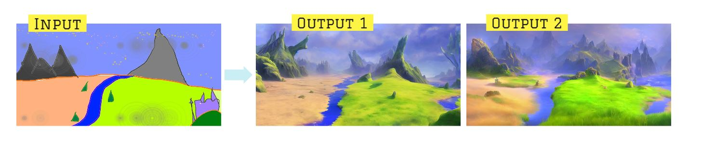

# home-improvement

Exterior design using stable-diffusion 🏡

#### References

1. `CompVis` Stable Diffusion  
   [High-Resolution Image Synthesis with Latent Diffusion Models](https://github.com/CompVis/stable-diffusion)

2. `Basujindal` fork optimisation for lesser VRAM  
   [Optimized Stable Diffusion (Sort of)](https://github.com/basujindal/stable-diffusion)

# 🖼️→🖼️ `img2img`

Using an input image to create unlimited variations.

- Img from [`jansteffen` on r/stablediffusion](https://www.reddit.com/r/StableDiffusion/comments/wwmjih/converting_a_minecraft_screenshot_into_a_painting/)


# 🖼️→🖼️ `img2img` with custom images

```py
pstring = "An fantasy english family home, dog in the foreground, fantasy, illustration, trending on artstation"
input_img = "../inputs/halle_at_home_2021_s.JPG"

strength = range(30, 75, 5)
for s in strength:
    !python optimizedSD/optimized_img2img.py --prompt "{pstring}" --init-img {input_img} --strength {s*0.01} --seed 200 --outdir {outdir}
```


</br>  
</br>

# 🖼️→🖼️ `img2img` with `hand-drawn` sketch

[Example shown on `CompVis` project page](https://github.com/CompVis/stable-diffusion#image-modification-with-stable-diffusion) 🔗



</br>
</br>

# 🖼️→🖼️ Iterative improvements with a sketch

Example from [`argaman123`](hhttps://old.reddit.com/r/StableDiffusion/comments/wzlmty/its_some_kind_of_black_magic_i_swear/) 🔗

- Using the output of one image to generate a new image.
- This iterative process can make increasingly complex and customizable images.

> _A distant futuristic city full of tall buildings inside a huge transparent glass dome, In the middle of a barren desert full of large dunes, Sun rays, Artstation, Dark sky full of stars with a shiny sun, Massive scale, Fog, Highly detailed, Cinematic, Colorful_


```py
!python optimizedSD/optimized_img2img.py --prompt "{pstring}" --init-img {input_img} --strength 0.8 --n_iter 2 --n_samples 3 --H 512 --W 512 --seed 12 --outdir {outdir} --ddim_steps 200
```

</br>
</br>

# Training Data Visualisations

`LAION-Aesthetics v2 6+` on Datasette:

1. Top Artists  
   https://laion-aesthetic.datasette.io/laion-aesthetic-6pls/artists?_sort_desc=image_counts

2. Search by Artist  
   https://laion-aesthetic.datasette.io/laion-aesthetic-6pls/images?_search=%22Thomas+Kinkade%22&_sort=rowid
