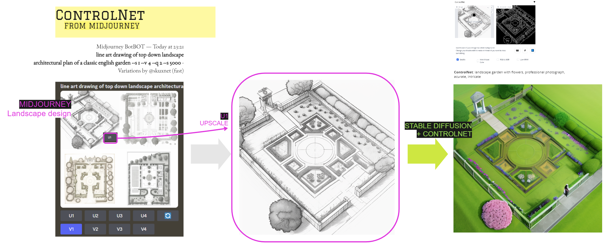
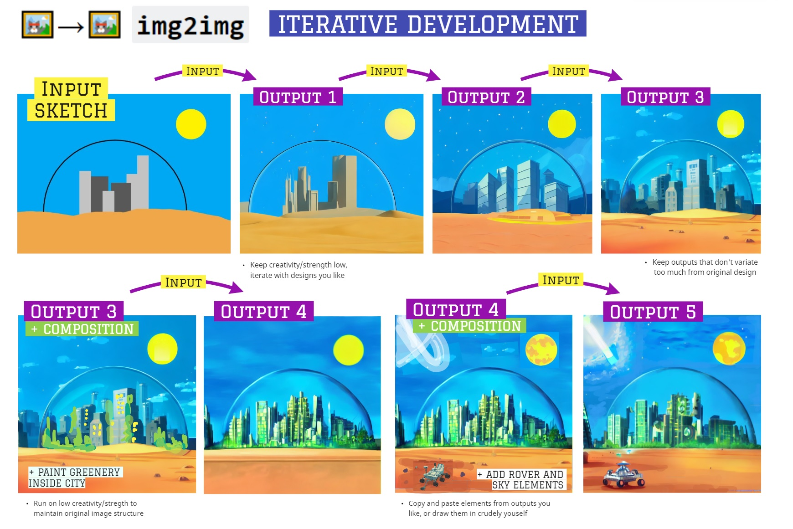

# home-improvement

Exterior design using stable-diffusion 🏡 → General [install instructions](https://github.com/hlky/stable-diffusion/wiki/Installation).

#### References

1. `CompVis` Stable Diffusion  
   [High-Resolution Image Synthesis with Latent Diffusion Models](https://github.com/CompVis/stable-diffusion)

2. `Basujindal` fork optimisation for lesser VRAM  
   [Optimized Stable Diffusion (Sort of)](https://github.com/basujindal/stable-diffusion)


# 🎨→🖼️ Generation from scratch with `MidJourney` + `controlnet` 
1. **Midjourney**
```py
line art drawing of top down landscape 
architectural plan of a classic english garden --s 1 --v 4 --q 2 --s 5000
```
2. **Stable Diffusion** + **ControlNet** with canny-fp16
```py
landscape garden with flowers, professional photograph, acurate, intricate
```


</br>  

# 🖼️→🖼️ `img2img` with custom images

```py
pstring = "An fantasy english family home, dog in the foreground, fantasy, illustration, trending on artstation"
input_img = "../inputs/halle_at_home_2021_s.JPG"

strength = range(30, 75, 5)
for s in strength:
    !python optimizedSD/optimized_img2img.py --prompt "{pstring}" --init-img {input_img} --strength {s*0.01} --seed 200 --outdir {outdir}
```


# Features
# 🖼️→🖼️ `img2img` iterative improvements

Example from [`argaman123`](hhttps://old.reddit.com/r/StableDiffusion/comments/wzlmty/its_some_kind_of_black_magic_i_swear/) 🔗

- Using the output of one image to generate a new image.
- This iterative process can make increasingly complex and customizable images.

> _A distant futuristic city full of tall buildings inside a huge transparent glass dome, In the middle of a barren desert full of large dunes, Sun rays, Artstation, Dark sky full of stars with a shiny sun, Massive scale, Fog, Highly detailed, Cinematic, Colorful_

</br>




```py
!python optimizedSD/optimized_img2img.py --prompt "{pstring}" --init-img {input_img} --strength 0.8 
--n_iter 2 --n_samples 3 --H 512 --W 512 --seed 12 --outdir {outdir} --ddim_steps 200
```

</br>
</br>


# 📱🖼️ Gradio WebUI by `hlky` 

Gradio webui by hlky https://github.com/sd-webui/stable-diffusion-webui

* Clone repo
* Run `webui.bat` from windows explorer


</br>
</br>

# Training Data Visualisations

`LAION-Aesthetics v2 6+` on Datasette:

From [this blog post](https://waxy.org/2022/08/exploring-12-million-of-the-images-used-to-train-stable-diffusions-image-generator/), and [Hackernews](https://news.ycombinator.com/item?id=32655497) conversation.

1. Top Artists  
   https://laion-aesthetic.datasette.io/laion-aesthetic-6pls/artists?_sort_desc=image_counts

2. Search by Artist  
   https://laion-aesthetic.datasette.io/laion-aesthetic-6pls/images?_search=%22Thomas+Kinkade%22&_sort=rowid


</br>
</br>

